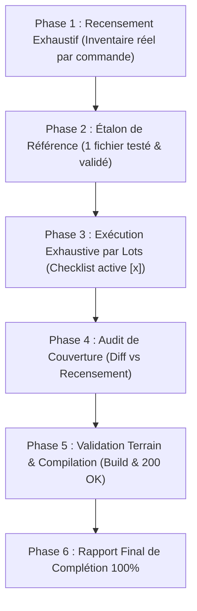

# Skill : Modification Globale & Exhaustive (`modif-globale`)

> **Version :** 1.0.0  
> **Mission :** Éliminer le biais de paresse des IA (qui ne traitent que 2 ou 3 « pages principales ») et **forcer l'exécution intégrale et méthodique** sur 100% du périmètre demandé.  
> **Principe absolu :** Aucun raccourci, aucune omission. Si une consigne s'applique à « toutes les pages », chaque fichier identifié doit être traité, coché et validé.

---

## 1. Déclencheurs & Quand Activer ce Skill

Activez impérativement ce skill dès que la requête de l'utilisateur contient l'une des formulations suivantes :
- `modif-globale` / `modification générale` / `modif globale`
- `sur toutes les pages` / `dans chaque page` / `parcours toutes les pages`
- `applique partout` / `change ça sur tout le site` / `sur l'ensemble des fichiers`
- `refonte globale de...` / `across all pages` / `global refactor`

---

## 2. Le Piège à Éviter (Anti-Paresse de l'IA)

### 🚫 Ce qui est STRICTEMENT INTERDIT :
- Traiter 3 ou 4 pages vedettes (ex. Accueil, Contact, Événements) et ignorer le reste en prétendant que « c'est fait ».
- Utiliser des phrases d'évitement comme :
  - *"J'ai appliqué la modification aux pages principales..."*
  - *"Le reste des pages suit le même modèle..."*
  - *"Pour des raisons de concision, voici un échantillon..."*
  - *"etc."* ou des listes à puces tronquées.

---

## 3. Méthodologie en 6 Phases Bloquantes



---

### Phase 1 : Recensement Exhaustif (Le Recensement)

Avant de toucher à la moindre ligne de code, l'agent **DOIT** exécuter une commande machine pour recenser **la totalité** des cibles.

1. **Commande de recensement (exemples selon le framework) :**
   ```bash
   # Pour un projet Astro / Next.js / Nuxt / Vite :
   find src/pages -type f \( -name "*.astro" -o -name "*.tsx" -o -name "*.vue" \) | sort
   # Ou par recherche de motif spécifique :
   grep -rl "header" src/pages/ | sort
   ```
2. **Affichage obligatoire de la Checklist Initiale :**
   L'agent doit imprimer dans sa réponse la liste numérotée exhaustive avec des cases à cocher `[ ]` :
   ```markdown
   ### Périmètre recensé (Total : N fichiers) :
   - [ ] 1. `src/pages/index.astro`
   - [ ] 2. `src/pages/evenements/index.astro`
   - [ ] 3. `src/pages/services/index.astro`
   - [ ] 4. `src/pages/services/organisation-evenements.astro`
   ...
   - [ ] N. `src/pages/contact.astro`
   ```

---

### Phase 2 : Étalon de Référence (Le Template Test)

1. Choisir **un seul fichier** représentatif parmi la liste.
2. Appliquer la modification demandée de façon exemplaire.
3. Vérifier la conformité visuelle, technique et la compilation (`npm run build` ou test local).
4. Définir le motif standard de remplacement qui sera appliqué aux autres fichiers.

---

### Phase 3 : Exécution Exhaustive par Lots (Parcours Intégral)

1. **Traitement par lots de 3 à 5 fichiers maximum** :
   - Modifier chaque fichier du lot à l'aide de l'outil d'édition approprié.
   - Ne jamais faire de modifications massives incontrôlées en une seule passe aveugle.
2. **Mise à jour de la Checklist** :
   - À la fin de chaque lot, cocher formellement les fichiers traités (`[x]`).
   - Si un fichier recensé s'avère ne pas nécessiter de modification (ex: déjà conforme ou cas particulier), l'agent **DOIT** expliciter la raison technique et ne pas simplement le passer sous silence.

---

### Phase 4 : Audit de Couverture (Le Décompte de Contrôle)

Pour prouver mathématiquement qu'aucune page n'a été oubliée :
1. Exécuter :
   ```bash
   git status -s
   # ou
   git diff --name-only
   ```
2. Comparer les fichiers listés par `git diff` avec la liste de la Phase 1.
3. **Condition bloquante :** Si `Nombre de fichiers modifiés + Fichiers justifiés sans changement < N`, l'agent a failli et doit immédiatement traiter les fichiers manquants.

---

### Phase 5 : Validation Terrain & Compilation

1. **Compilation complète du projet :**
   ```bash
   npm run build
   ```
   *(La compilation doit réussir sans aucune erreur ni avertissement critique)*.
2. **Redémarrage ou actualisation du service (si applicable) :**
   ```bash
   pm2 restart <nom-du-service>
   ```
3. **Test HTTP réel :**
   Effectuer une requête curl ou un test direct sur les routes modifiées pour vérifier les codes de retour (HTTP 200).

---

### Phase 6 : Rapport Final de Complétion 100%

L'agent conclut sa tâche en présentant :
1. La checklist finale avec **100% des éléments cochés `[x]`**.
2. Le résumé du `git diff --stat`.
3. Les URLs ou commandes permettant à l'utilisateur de constater le résultat sur l'ensemble du projet.

---

## 4. Règle d'Or en Cas de Fatigue ou Contexte Élevé

Si le nombre de fichiers est très important (> 20 fichiers) :
- Ne **jamais** abandonner la méthode.
- Découper en tranches numérotées explicites : Tranche A (fichiers 1 à 10), Tranche B (fichiers 11 à 20).
- Sauvegarder l'état dans un fichier temporaire ou scratchpad si nécessaire (`scratch/progress.json`).
- Commiter et pusher chaque tranche cohérente (`git commit -m "..." && git push`).
