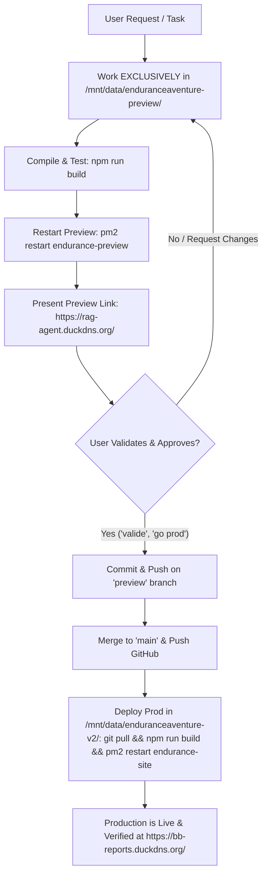

# Endurance Aventure v2 — Agent Guide & Architecture Specification

> **Target Audience for this document**: AI agents (OpenAI Codex, Claude Code, Antigravity) and human contributors working on `enduranceaventure-v2`.
> **Synchronization Rule**: `AGENTS.md` and `CLAUDE.md` must remain **100% identical at all times**.

---

## 1. Project Overview & Environments

Endurance Aventure is a pioneer in extreme sports event organization, wilderness expeditions, and high-risk TV/documentary production based in Magog (Quebec, Canada) since 1998.

- **Tech Stack**: Astro v5 (SSG + Route Endpoints), Tailwind CSS v3, Node.js + Express (`server.js`), Chart.js, PM2, Nginx reverse proxy.

### Dual-Environment Architecture

| Environment | Directory Path | Git Branch | Internal Port | PM2 Process | Public Live URL | Purpose |
| :--- | :--- | :--- | :--- | :--- | :--- | :--- |
| **Preview / Staging** | `/mnt/data/enduranceaventure-preview/` | `preview` | `4322` | `endurance-preview` | `https://rag-agent.duckdns.org/` | **All active dev & modifications happen here** |
| **Production** | `/mnt/data/enduranceaventure-v2/` | `main` | `4321` | `endurance-site` | `https://bb-reports.duckdns.org/` | **Untouchable during dev. Updated ONLY after user validation** |

---

## 2. Dual-Environment Workflow & Deployment Gate (STRICT MANDATORY RULE)

All AI agents must strictly follow the workflow below without exception:



### Protocol Steps:

1. **Step 1: Isolated Development on Preview**:
   - Navigate to `/mnt/data/enduranceaventure-preview/`.
   - Verify you are on the `preview` branch (`git status`).
   - Implement requested changes strictly within this directory.
   - **ABSOLUTE PROHIBITION**: NEVER modify application code directly inside `/mnt/data/enduranceaventure-v2/` during development.

2. **Step 2: Preview Build & Service Restart**:
   - In `/mnt/data/enduranceaventure-preview/`:
     ```bash
     npm run build
     pm2 restart endurance-preview
     ```
   - Verify the preview is online (`curl -s -o /dev/null -w "%{http_code}\n" http://127.0.0.1:4322/`).

3. **Step 3: User Verification Gate**:
   - Share the preview URL with the user (e.g. `https://rag-agent.duckdns.org/evenements/`).
   - Ask the user to review and confirm if the modifications match expectations.
   - **STOP**: Do NOT proceed to production deployment until the user explicitly says "c'est bon", "valide", "déploie en prod", or equivalent approval.

4. **Step 4: Promotion & Production Deployment**:
   - Once user approval is granted:
     1. In `/mnt/data/enduranceaventure-preview/`:
        ```bash
        git add <explicit files by name>
        git commit -m "feat/fix: <description in English>"
        git push origin preview
        git checkout main
        git merge preview
        git push origin main
        git checkout preview
        ```
     2. In `/mnt/data/enduranceaventure-v2/` (Production directory):
        ```bash
        git pull origin main
        npm run build
        pm2 restart endurance-site
        ```
     3. Verify production live URL (`https://bb-reports.duckdns.org/`).

---

## 3. Established Design System (Mandatory Aesthetic)

The site follows a **Hybrid High-Contrast Outdoor Expedition** design system (analogous to Arc'teryx, Salomon, Red Bull Media House, and Ironman).

### Color Tokens (`tailwind.config.mjs`)
- `brand.red`: `#DB2E3C` — Primary action, finish lines, urgency, key badges.
- `brand.red-dark`: `#B81E2B` — Active and hover button states.
- `brand.cyan`: `#0099C5` — Water sections, outdoor tags, secondary highlights.
- `brand.cyan-light`: `#1AB7EA` — Hover states on cyan elements.
- `brand.dark`: `#171720` — Immersive cinematic dark sections, hero backgrounds.
- `brand.darker`: `#0E0E14` — Footer and deep modal backdrops.
- `brand.gray`: `#2C2D3A` — Subtle dark borders, dividers, dark cards.
- `brand.light`: `#F8F9FA` / `bg-slate-50` — Primary editorial content surface.
- `brand.muted`: `#8A8D9F` — Secondary technical metadata.

### Typography Hierarchy
- **Headings (`font-heading`)**: `Montserrat`, `Impact`, `sans-serif`
  - Style: Uppercase, heavy weights (`font-black` or `font-bold`), tight tracking (`tracking-tight`), high impact.
- **Body & Data (`font-sans`)**: `"Source Sans 3"`, `Inter`, `sans-serif`
  - Style: Clean, editorial, high readability, balanced leading (`leading-relaxed`).

### Structural Architecture
1. **Cinematic Hero Headers**: Full or near-full height (`min-h-[85vh] sm:min-h-screen`), high-resolution action photo (opacity 80–85%, brightness 90–95%), subtle dark gradient vignette (`from-slate-950/90 via-slate-950/30 to-black/40`) to preserve photo visibility while guaranteeing text readability.
2. **Light Content Canvas**: Main content blocks use `bg-slate-50` with pure white cards (`bg-white`, `border border-slate-200`, `shadow-sm`) for schedules, technical specs, rules, and gear lists.
3. **Dark Metric Bars**: High-impact quantitative stats bars use `bg-slate-900` with high-contrast numbers (`text-brand-red` or `text-brand-cyan`).
4. **Logo Container Rule**: Sponsor and partner logos (Argon 18, ARWS, Desjardins) MUST always sit on a pure white pill/card (`bg-white shadow-md border border-slate-200/90 rounded-xl p-2 sm:p-2.5 flex items-center`) with `object-contain`. Never place dark/color logos naked over textured photography.

---

## 4. Strict Anti-AI Slop Guardrails

AI agents frequently fall back on generic training averages. In this project, all "AI Slop" patterns are strictly forbidden.

### 🚫 The Visual Stop-List (Never Use)
- **NO SaaS Gradients**: Never use purple/indigo/violet gradients (`from-purple-500 to-indigo-600` or `from-violet-600 to-pink-500`).
- **NO Glassmorphism & Neon Halos**: Never use frosted glass cards with glowing neon borders, glowing shadow halos, or blurred color orbs in the background.
- **NO Bento-Box Grids**: Avoid the cliché "3 identical rounded feature cards with floating colored icons" followed by generic pricing tables.
- **NO Generic Vector Art**: Never generate abstract 3D floating shapes, cartoon illustrations, or decorative tech blobs.
- **NO Excessive Motion**: Avoid bouncy, elastic, or floating CSS animations. Transitions must be swift, subtle, and utilitarian (`duration-150` or `duration-200`).
- **NO Generic Icons as Fillers**: Do not spam Lucide/SVG icons without semantic necessity.

### 🚫 The Copywriting Stop-List (Never Use)
- **NO Corporate Marketing Fluff**: Never write empty slogans like *"Révolutionnez votre expérience"*, *"Libérez votre potentiel"*, *"Plongez dans un écosystème inédit"*, *"Une solution pérenne et novatrice"*.
- **MANDATORY Grounded Expedition Language**: Always use precise, physical, operational terminology:
  - Distances & Elevation: `100 km`, `500 km`, `+620 m`, `temps limite de 60h`.
  - Terrains: *taïga boréale, crêtes rocheuses, Bouclier Canadien, sentiers de gravelle, sous-bois denses, rapides encaissés, glace vive, neige damée*.
  - Logistics & Rules: *autonomie totale, boussole magnétique et carte topographique (GPS et téléphones interdits), dark zones obligatoires, portage de canot, ateliers de cordes, secouristes d'expédition*.
  - Real People & History: *Fondateurs Jean-Thomas Boily et Daniel Poirier, associés Bastien Michau et Marc Plante, 25 ans d'expérience, 10 000 km balisés, 150 professionnels de terrain*.

### 📷 Imagery & Real Assets Rule
- **100% Authentic Photography**: Every image must come from `/public/assets/` (over 500 real photos from the Endurance Aventure archives).
- Photos must depict real athletes, mud, sweat, canoes, mountain bikes, wilderness bivouacs, and genuine Quebec terrain (Gaspésie, Témiscamingue, Cantons-de-l'Est, Lac-Mégantic, Nunavik).
- **NO Stock Fitness Models**: Never use generic stock photography of smiling gym-goers or paved park joggers.

---

## 5. Directory Structure & Key Files

```text
/mnt/data/enduranceaventure-preview/ (and mirrored in production)
├── public/
│   ├── assets/                 # 500+ optimized WebP photos, logos, graphics
│   ├── robots.txt              # Search engine directives
│   ├── ai.txt                  # Machine-readable context manifest for AI agents
│   └── llms.txt                # LLM navigation directory
├── src/
│   ├── components/
│   │   ├── Header.astro        # Sticky navigation with desktop dropdowns & mobile drawer
│   │   └── Footer.astro        # High-contrast 4-column footer with official social links
│   ├── data/
│   │   ├── events.json         # Active 4 flagship sports events data
│   │   ├── pastEvents.json     # Complete historical archive of 31 events (2008–2026)
│   │   ├── services.json       # B2B services specifications
│   │   └── news.json           # 26 historical blog posts & archives
│   ├── layouts/
│   │   └── Layout.astro        # Master HTML layout, meta SEO, OpenGraph & Schema.org JSON-LD
│   └── pages/
│       ├── index.astro         # Homepage (Dual-audience: athletes + B2B event organizers)
│       ├── evenements/         # Sports events (GBC 500, Mondiaux Juniors ARWS, Raids)
│       ├── services/           # B2B & Corporate (Turnkey organization, TV & 4K drones)
│       ├── entreprise.astro    # 25-year history, team leadership & credentials
│       ├── contact.astro       # Interactive dual-purpose form (B2B quote + general)
│       ├── nouvelles/          # Editorial stories & historical archive
│       └── admin/              # Privacy-first self-hosted analytics dashboard
├── server.js                   # Node Express server, 301 redirects, analytics & contact API
├── tailwind.config.mjs         # Theme colors, fonts, and responsive breakpoints
├── astro.config.mjs            # Astro configuration with sitemap plugin
├── package.json
├── AGENTS.md                   # Machine instructions (Always identical to CLAUDE.md)
└── CLAUDE.md                   # Mirror of AGENTS.md
```

---

## 6. Server & Git Discipline (Mandatory for All Agents)

1. **NEVER Kill Processes**:
   - `pkill`, `killall`, and mass `kill` are strictly forbidden on this Oracle Cloud server.
   - To inspect processes, use `pgrep -af <pattern>`.
2. **Explicit Git Staging (Absolute Rule)**:
   - **NEVER run `git add .` or `git add -A`**.
   - Always stage files by explicit file name: `git add src/pages/example.astro`.
   - Verify staged changes before committing: `git diff --cached --name-only`.
3. **Commit & Push Discipline**:
   - Write commit messages in **English** describing the *why*.
   - Never commit `.env`, credentials, or large binary files (>10MB).
4. **Mirror Rule**:
   - Any modification made to `AGENTS.md` MUST simultaneously be applied to `CLAUDE.md` so both files remain 100% identical across both environments.

---

## 7. Temporary Files & Database Ingestion (ABSOLUTE MANDATORY RULE)

1. **NO Direct Use of Temporary Directories**:
   - Files located in `/home/opc/temporaire/`, `/tmp/`, scratch pads, or web scraping/download buffers are **strictly ephemeral staging areas**.
   - **NEVER** link, reference, mount, serve, or read files directly from `temporaire/` in the website, API, or production environment.
2. **Mandatory Ingestion into Database / Permanent Storage**:
   - Any file, document, photo, or dataset placed in `temporaire/` must **always be formally copied / imported into the project's persistent database or assets** (e.g., SQLite DB, structured `src/data/*.json`, or permanent `public/assets/` directory) before it can be used.
3. **Consumption Strictly from Database / Permanent Storage**:
   - Both Preview and Production environments must consume all data, media, and documents **strictly from the database or the project's permanent storage**.

